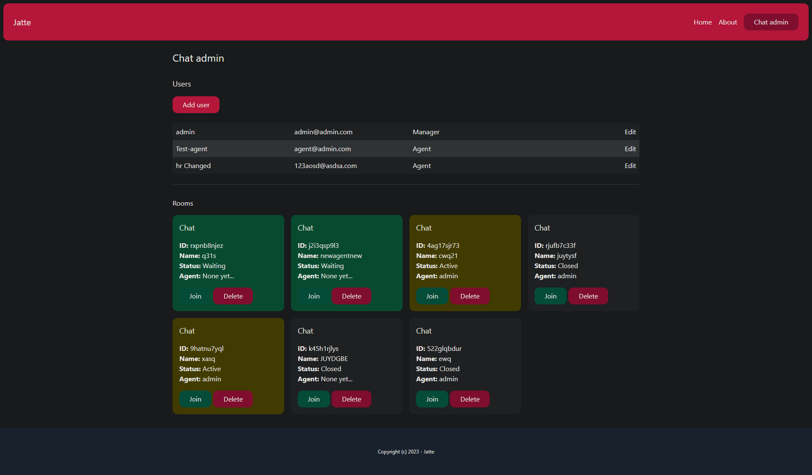
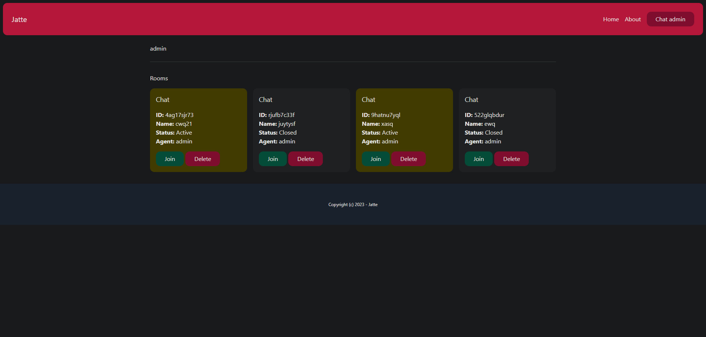
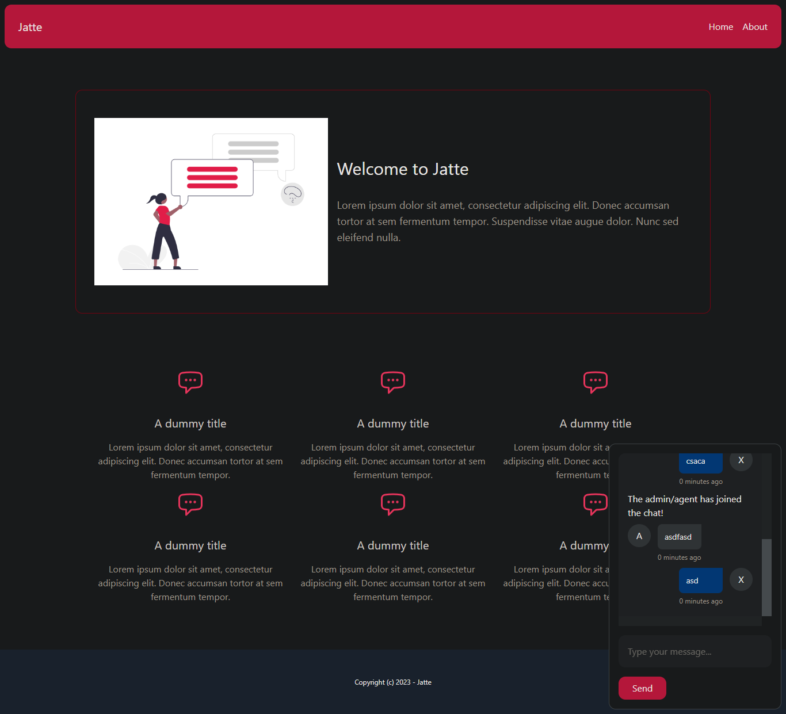
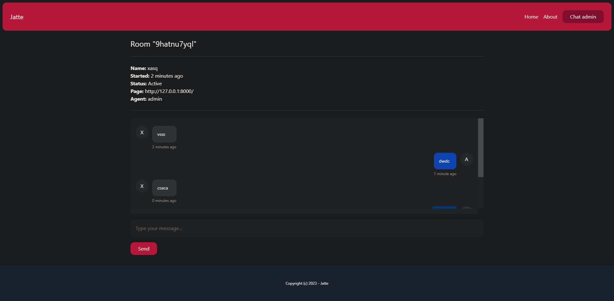

<br/>
<p align="center">
    

  <h3 align="center">realtime-chat Web Application</h3>
</p>


## Table Of Contents

* [About the Project](#about-the-project)
* [Usage](#usage)

## About The Project

Jatte is a real-time chat web application built using Django, Channels, JavaScript, and Tailwind CSS. It allows users to engage in real-time conversations in chat rooms.


## Features
- Real-time chat functionality: Engage in real-time conversations with other users.
- Multiple chat rooms: Create or join different chat rooms based on topics or interests.
- User authentication and authorization: Securely manage user access and permissions.
- Responsive design using Tailwind CSS: Ensure the application looks great on all devices.






## Usage

Follow these steps to get started with the Jatte web app:

```sh
git clone https://github.com/Arl-Miz/RealTime_chatApp.git
cd RealTime_chatApp/
pip install -r requirements.txt
python manage.py migrate
python manage.py runserver 8000
```

the go to this url on your browser:

```sh
http://127.0.0.1:8080/chat-admin/
```

to access the admin panel:

```sh
python manage.py createsuperuser
```
the go to this url:

```sh
http://127.0.0.1:8080/chat-admin/
```

# License

This project is licensed under the MIT License.
